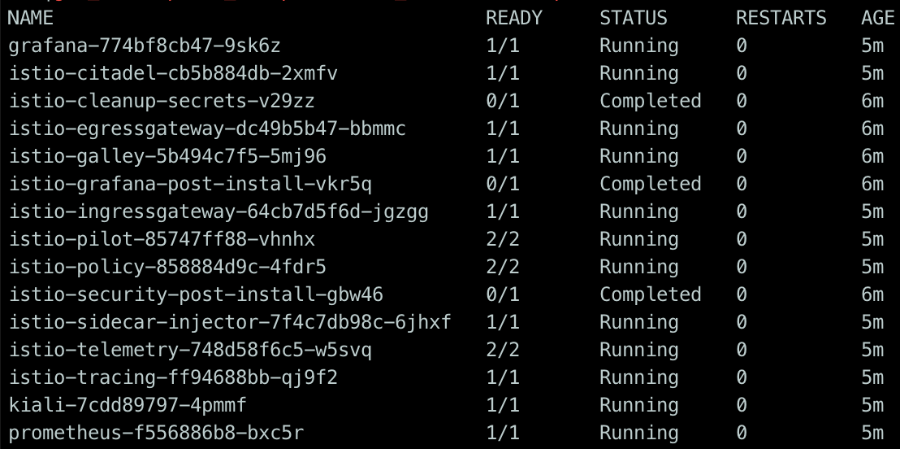

### Setup

#### 1. Workspace

```shell
export ISTIO_WORKSHOP=$HOME/service-mesh-workshop # or whatever
mkdir $ISTIO_WORKSHOP
cd $ISTIO_WORKSHOP
```

#### 2. Tools installieren

**gcloud & kubectl**

```shell
curl https://sdk.cloud.google.com | bash
exec -l $SHELL
gcloud init 
```

**helm**

macOS

```shell
brew install kubernetes-helm
```

Google Cloudshell

```shell
curl https://raw.githubusercontent.com/kubernetes/helm/master/scripts/get | bash
```

Linux/Windows [--> follow me](https://docs.helm.sh/using_helm/#installing-helm)

#### 3. Cluster aufsetzen

**Option 1: GKE Cluster**

> TODO: gcloud auth


```shell
# set region & zone
gcloud config set compute/region europe-west3 # Frankfurt
gcloud config set compute/zone europe-west3-c

# enable container & registry
gcloud services enable container.googleapis.com containerregistry.googleapis.com

gcloud container clusters create istio-workshop \
      --enable-autoscaling --min-nodes=2 --max-nodes=3 --num-nodes=2 \
      --machine-type n1-standard-2 --enable-autoupgrade \
      --scopes cloud-platform

# not in cloudshell
gcloud auth configure-docker -q 

kubectl create clusterrolebinding cluster-admin-binding \
    --clusterrole=cluster-admin \
    --user=$(gcloud config get-value core/account)
```

**Option 2: Minikube** 

```
TODO
```

#### 4. Istio installieren (mit Prometheus, Grafana, Jaeger, Kiali)

```shell
cd $ISTIO_WORKSHOP
curl -L https://git.io/getLatestIstio | sh -
cd istio-1.0.5
kubectl apply -f install/kubernetes/helm/istio/templates/crds.yaml

kubectl create namespace istio-system

helm template install/kubernetes/helm/istio \
    --set grafana.enabled=true --set tracing.enabled=true --set kiali.enabled=true \
    --set "kiali.dashboard.jaegerURL=http://localhost:16686" \
    --set "kiali.dashboard.grafanaURL=http://localhost:3000" \
    --name istio --namespace istio-system > $ISTIO_WORKSHOP/istio.yaml
kubectl apply -f $ISTIO_WORKSHOP/istio.yaml

kubectl label namespace default istio-injection=enabled
```

**Wiederhole** diesen Befehl so lange, bis alle Pods den Status `Running`  oder `Completed` haben

```shell
kubectl  -n istio-system get pods
```

Das sollte dann so aussehen:




**FERTIG!**

Nun folgendes:

1. Trag ein wie weit du bist: vielleicht kannst du jemandem helfen

   > `TODO: Realtimeboard / Trello?`

2. Im nächsten Schritt installieren wie eine Beispielanwendung mit der wir die Mesh-Funktionionen ausprobieren. --> Hier geht's weiter

   > TODO: Link

