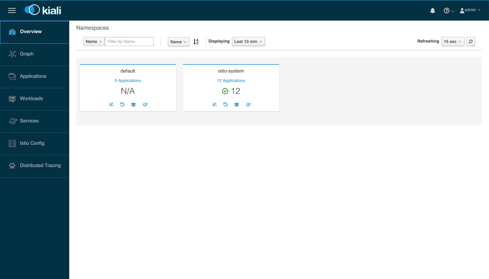

### Setup

#### 1. Workspace

```shell
export ISTIO_WORKSHOP=$HOME/service-mesh-workshop # or whatever
mkdir $ISTIO_WORKSHOP
cd $ISTIO_WORKSHOP
```

#### 2. Tools installieren

**gcloud & kubectl**

```shell
curl https://sdk.cloud.google.com | bash
exec -l $SHELL
gcloud init 
```

**helm**

macOS

```shell
brew install kubernetes-helm
```

Google Cloudshell

```shell
curl https://raw.githubusercontent.com/kubernetes/helm/master/scripts/get | bash
```

Linux/Windows [--> follow me](https://docs.helm.sh/using_helm/#installing-helm)

#### 3. Cluster aufsetzen

GKE Cluster

```shell
# set region & zone
gcloud config set compute/region europe-west3 # Frankfurt
gcloud config set compute/zone europe-west3-c

# enable container & registry
gcloud services enable container.googleapis.com containerregistry.googleapis.com

gcloud container clusters create istio-workshop \
      --enable-autoscaling --min-nodes=2 --max-nodes=3 --num-nodes=2 \
      --machine-type n1-standard-2 --enable-autoupgrade \
      --scopes cloud-platform

# not in cloudshell
gcloud auth configure-docker -q 

kubectl create clusterrolebinding cluster-admin-binding \
    --clusterrole=cluster-admin \
    --user=$(gcloud config get-value core/account)
```

Minikube

```
TODO
```

#### 4. Istio installieren (mit Prometheus, Grafana, Jaeger, Kiali)

```shell
cd $ISTIO_WORKSHOP
curl -L https://git.io/getLatestIstio | sh -
cd istio-1.0.5
kubectl apply -f install/kubernetes/helm/istio/templates/crds.yaml

kubectl create namespace istio-system

helm template install/kubernetes/helm/istio \
    --set grafana.enabled=true --set tracing.enabled=true --set kiali.enabled=true \
    --set "kiali.dashboard.jaegerURL=http://localhost:16686" \
    --set "kiali.dashboard.grafanaURL=http://localhost:3000" \
    --name istio --namespace istio-system > $ISTIO_WORKSHOP/istio.yaml
kubectl apply -f $ISTIO_WORKSHOP/istio.yaml

kubectl label namespace default istio-injection=enabled
```

#### 5. Port-forwarding von Prometheus, Jaeger und Istio

Wiederhole diesen Befehl so lange, bis alle Pods den Status `Running`  oder `Completed` haben

```shell
kubectl get pods -n istio-system
```

Das sollte dann so aussehen:

```
NAME                                      READY     STATUS      RESTARTS   AGE
grafana-774bf8cb47-9sk6z                  1/1       Running     0          5m
istio-citadel-cb5b884db-2xmfv             1/1       Running     0          5m
istio-cleanup-secrets-v29zz               0/1       Completed   0          6m
istio-egressgateway-dc49b5b47-bbmmc       1/1       Running     0          6m
istio-galley-5b494c7f5-5mj96              1/1       Running     0          6m
istio-grafana-post-install-vkr5q          0/1       Completed   0          6m
istio-ingressgateway-64cb7d5f6d-jgzgg     1/1       Running     0          5m
istio-pilot-85747ff88-vhnhx               2/2       Running     0          5m
istio-policy-858884d9c-4fdr5              2/2       Running     0          5m
istio-security-post-install-gbw46         0/1       Completed   0          6m
istio-sidecar-injector-7f4c7db98c-6jhxf   1/1       Running     0          5m
istio-telemetry-748d58f6c5-w5svq          2/2       Running     0          5m
istio-tracing-ff94688bb-qj9f2             1/1       Running     0          5m
kiali-7cdd89797-4pmmf                     1/1       Running     0          5m
prometheus-f556886b8-bxc5r                1/1       Running     0          5m
```

Führe diese Befehle aus, um die **Ports im Cluster auf deinen localhost umzuleiten**:

```
kubectl -n istio-system port-forward deployment/istio-tracing 16686:16686 &
kubectl -n istio-system port-forward deployment/grafana 3000:3000 &
kubectl -n istio-system port-forward deployment/kiali 20001:20001 &
open http://localhost:20001
```

Dann sollte sich dein Browser mit http://localhost:20001 öffnen. Gib diese Nutzerdaten ein:

| Username     | admin     |
| ------------ | --------- |
| **Passwort** | **admin** |

Die Oberfläche sollte dann so aussehen:



Öffne außerdem http://localhost:3000 und http://localhost:16686


#### 5. Install Hipstershop

```
cd $ISTIO_WORKSHOP/hipstershop
kubectl apply -f ./kubernetes-manifests-local
```


```
kubectl apply -f ./istio-manifests
```

