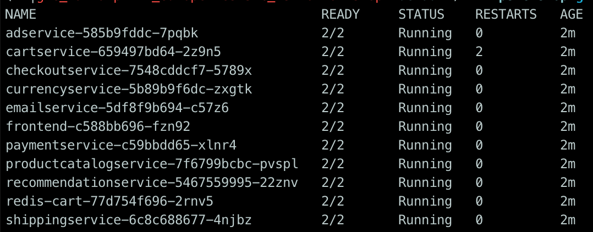
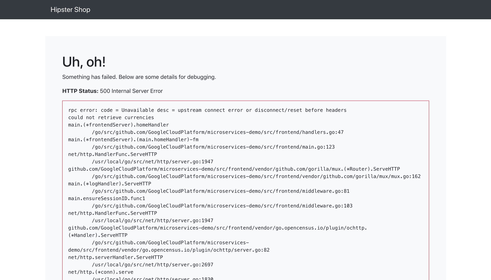
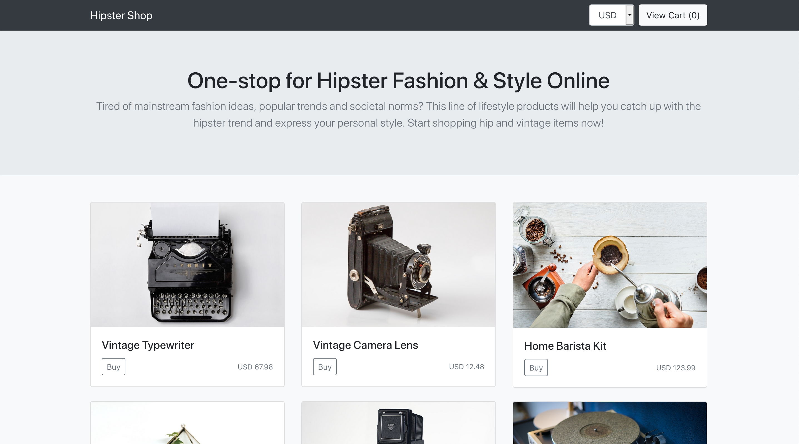

### Hipstershop

#### 1. Micoservices deployen

```shell
cd $ISTIO_WORKSHOP/hipstershop
kubectl apply -f ./kubernetes-manifests
```

Wiederhole diesen Befehl so lange, bis alle Pods den Status `Running`  oder `Completed` haben

```shell
kubectl get pods
```

Das sollte dann so aussehen:




#### 2. Einstiegs-IP raussuchen

Jetzt müssen wir die IP von dem Istio-Einstiegspunkt (Ingress-Gateway) herausfinden:

```shell
INGRESS_HOST="$(kubectl -n istio-system get service istio-ingressgateway -o jsonpath='{.status.loadBalancer.ingress[0].ip}')"

echo "$INGRESS_HOST"
curl http://$INGRESS_HOST
```

*NANU???* 

#### 3. Gateway konfigurieren 

Wir finden unter der IP noch nichts, weil wir noch nicht konfiguriert haben, dass wir nach Eintreten in das Mesh zu `frontend` wollen: 

```shell
kubectl apply -f istio-explore/01_setup/frontend-gateway.yaml
```

Diese Konfigurationen werden angewendet:

**Gateway** - Istio Standardgateway, dass alle Anfragen an `/` behandelt

```yaml
apiVersion: networking.istio.io/v1alpha3
kind: Gateway
metadata:
  name: frontend-gateway
spec:
  selector:
    istio: ingressgateway # nutze Istio's Standard Gateway Implementierung
  servers:
  - port:
      number: 80
      name: http
      protocol: HTTP
    hosts:
    - "*"
```

**VirtualService** - routet alle Anfragen vom gerade definierten `frontend-gateway` an den `frontend`-Service 


```yaml
apiVersion: networking.istio.io/v1alpha3
kind: VirtualService
metadata:
  name: frontend-ingress
spec:
  hosts:
  - "*"
  gateways:
  - frontend-gateway
  http:
  - route:
    - destination:
        host: frontend # leite auf den frontend-service weiter
        port:
          number: 80
```

Auf ein neues:

```shell
open http://$INGRESS_HOST
```

*Aber da ist IMMERNOCH was kaputt!*




#### 4. Externe Aufrufe freigeben

Der Fehler ist `could not retrieve currencies`, denn der Currency-Service versucht eine externe API `www.ecb.europa.eu` anzufragen. Das müssen wir noch erlauben:

```shell
kubectl apply -f istio-explore/01_setup/whitelist-egress-currencyprovider.yaml
```

**ServiceEntry** - gibt den Zugriff auf `www.ecb.europa.eu` unter Port 80 und 443 frei

```yaml
apiVersion: networking.istio.io/v1alpha3
kind: ServiceEntry
metadata:
  name: currency-provider-external
spec:
  hosts:
  - www.ecb.europa.eu
  ports:
  - number: 80
    name: http
    protocol: HTTP
  - number: 443
    name: https
    protocol: HTTPS
```

Jetzt aber:

```shell
open http://$INGRESS_HOST
```



**YIEHA!**

Nun folgendes:

1. Trag ein wie weit du bist: vielleicht kannst du jemandem helfen

   > `TODO: Realtimeboard / Trello?`

2. Im nächsten Schritt schauen wir uns an, wie wir ein Service Mesh nutzen können um das Verhalten unserer Microservices beobachten zu können --> Hier geht's weiter

   > TODO: Link