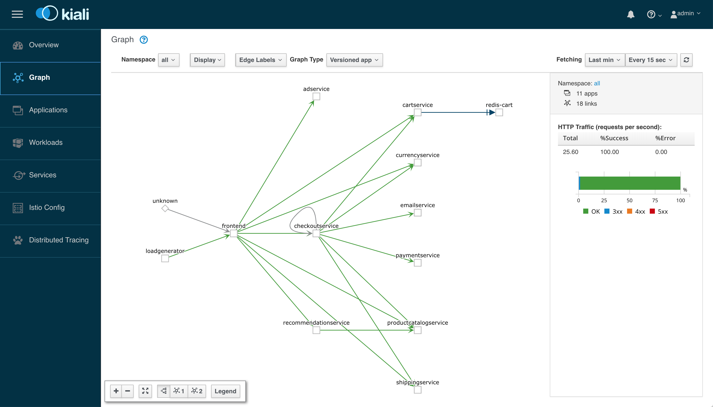
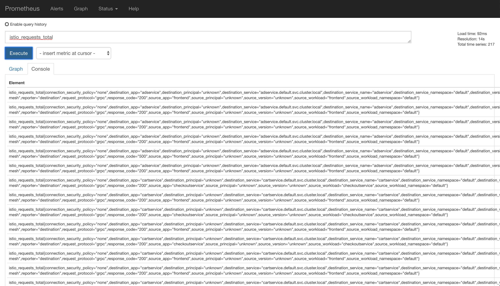
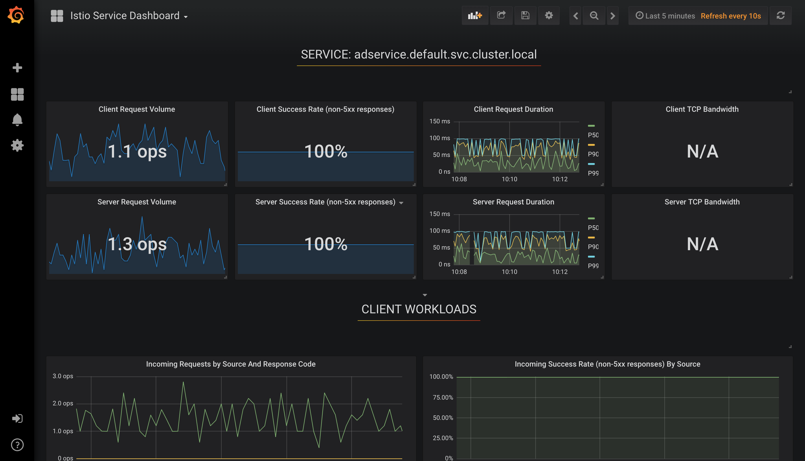
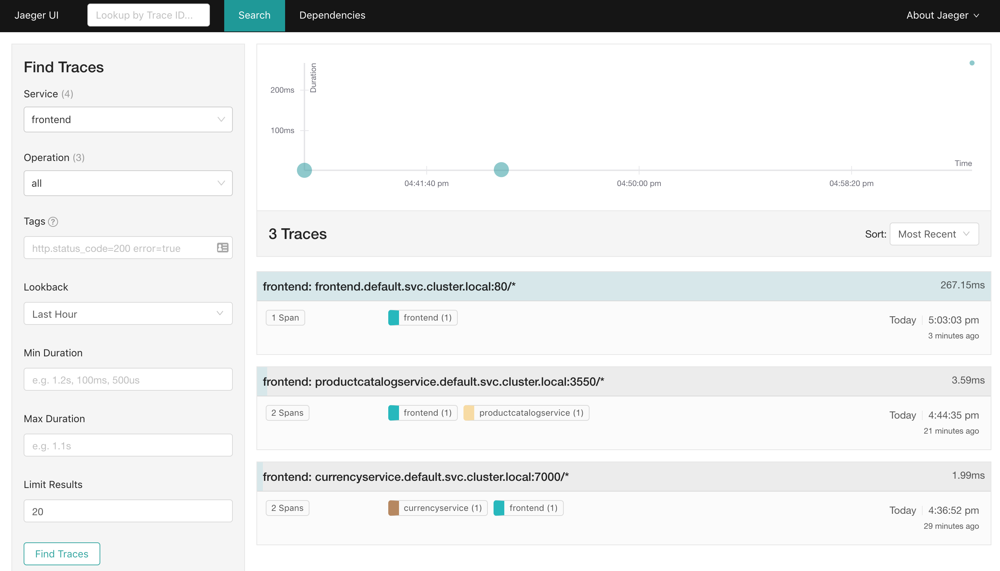

# Observability

[TOC]

> TODO: in 3 Dateien?

## Teil 1: Metriken

### 1. Basis-Metriken

#### 1.1 Port-forwarding von Prometheus, Grafana, Jaeger und Istio

Führe diese Befehle aus, um die **Ports im Cluster auf deinen localhost umzuleiten**:

```
kubectl -n istio-system port-forward deployment/prometheus 9090:9090 &
kubectl -n istio-system port-forward deployment/grafana 3000:3000 &
kubectl -n istio-system port-forward deployment/istio-tracing 16686:16686 &
kubectl -n istio-system port-forward deployment/kiali 20001:20001 &
```


#### 1.2 [Kiali](http://localhost:20001)

Öffne http://localhost:20001 im Browser und gib diese Nutzerdaten ein:

| Username     | admin     |
| ------------ | --------- |
| **Passwort** | **admin** |

Klicke auf links "*Graph*". Die Oberfläche sollte dann etwa so aussehen:




#### 1.3 [Prometheus](http://localhost:9292)

Öffne http://localhost:9292 im Browser und gib folgendes in der Eingabezeile ein:

> TODO

```

```





#### 1.4 [Grafana](http://localhost:3000)

Öffne  http://localhost:3000 im Browser. Erkunde die Bedeutung der Graphen 




#### 1.5 [Jaeger](http://localhost:16686)

Öffne http://localhost:16686 im Browser

> TODO Aufgaben
>
> TODO: neuer Screenshot

 


### 2. Metriken hinzufügen

#### Prometheus Handler ändern

> TODO: notwenig?

- Wir schauen uns die [Standard-Prometheus-Metriken](https://istio.io/docs/reference/config/policy-and-telemetry/metrics/) an
- Konfiguration einer Metriken für Prometheus

**prometheus** - Konsumiert Metriken und aggregiert sie als konfigurierbare Distributions/Histogramme oder Counter.

```yaml
apiVersion: config.istio.io/v1alpha2
kind: prometheus
metadata:
  name: handler
  namespace: istio-system
spec:
  metrics:
  - name: request_count
    instance_name: requestcount.metric.istio-system
    kind: COUNTER
    label_names:
    - destination_service
    - destination_version
    - response_code
  - name: request_duration
    instance_name: requestduration.metric.istio-system
    kind: DISTRIBUTION
    label_names:
    - destination_service
    - destination_version
    - response_code
    buckets:
      explicit_buckets:
        bounds: [0.005, 0.01, 0.025, 0.05, 0.1, 0.25, 0.5, 1, 2.5, 5, 10]
```

#### 2. Modell für Metriken überschreiben

> TODO nicht besser ein neues Modell?
>
> TODO: ales Modell danach wiederherstellen?

**metric** - Überschreibung der default requestduration-Metrik

```yaml
apiVersion: config.istio.io/v1alpha2
kind: metric
metadata:
  name: requestduration
  namespace: istio-system
spec:
  value: response.duration | "0ms"
  dimensions:
    destination_service: destination.service | "unknown"
    destination_version: destination.labels["version"] | "unknown"
    response_code: response.code | 000
  monitored_resource_type: '"UNSPECIFIED"'
```

**metric** - überschreibt die default requestcount-Metrik

```yaml
apiVersion: config.istio.io/v1alpha2
kind: metric
metadata:
  name: requestcount
  namespace: istio-system
spec:
  value: "1"
  dimensions:
    destination_service: destination.service | "unknown"
    destination_version: destination.labels["version"] | "whatever"
    response_code: response.code | 000
  monitored_resource_type: '"UNSPECIFIED"'
```


#### 3. Metriken mit Bedingung auf den Prometheus-Adapter mappen

Wenn `productcatalogservice` angefragt wird, sollen die neuen `requestduration`- und `requestcount`-Metriken erstellt und an Prometheus gesendet werden:

**rule** - Liefert die `requestduration`-Metrik an den `prometheus`-Handler wenn der Ziel-Service `productcatalogservice` ist.

```yaml
apiVersion: config.istio.io/v1alpha2
kind: rule
metadata:
  name: promhttp
  namespace: istio-system
spec:
  match: destination.service == "productcatalogservice.default.svc.cluster.local" 
  actions:
  - handler: handler.prometheus
    instances:
    - requestduration.metric.istio-system
    - requestcount.metric.istio-system
```

> TODO
>
> sum(rate(istio_request_count[10m])) by (destination_service)
>
> sum(istio_request_count) by (destination_service)
>
> TODO Screenshots


## Teil 2: Logging

**Inhalt:**

- Automatische Erzeugung von definierten Logeinträgen
- Weiterleitung der Logeinträge:
  - an die Standardausgabe (stdio) 
  - an Fluentd

### 1. Modell für die Logeinträge definieren 

Wir definieren das Format für einen Logeintrag:

- `source` - Quelle der Anfrage
- `destination`- Ziel der Anfrage
- `responseCode` - der HTTP-Code mit der die Anfrage beantwortet wurde
- `responseSize`- die Größe des Response-Bodys in Bytes
- `latency` - die Zeit bis die Anfrage beantwortet wurde
- `protocol` - das Protokoll über das die Anfrage gestellt wurde (http, https oder tcp)

```bash
kubectl apply -f istio-explore/logging/logentry.yaml
```

**logentry instance** - mapping von Attributen aus Request-Metadaten, Kontext etc. auf benutzerdefinierte Variablen

```yaml
apiVersion: "config.istio.io/v1alpha2"
kind: logentry
metadata:
  name: newlog
  namespace: istio-system
spec:
  severity: '"info"'
  timestamp: request.time | context.time | timestamp("2000-01-01T00:00:00Z") # default time
  variables:
    source: source.labels["app"] | source.workload.name | "unknown"
    destination: destination.labels["app"] | destination.workload.name | "unknown"
    responseCode: response.code | 0
    responseSize: response.size | 0
    latency: response.duration | "0ms"
    protocol: request.scheme | context.protocol | "unknown" # results in http, https or tcp
  monitored_resource_type: '"UNSPECIFIED"'
```

Hier ist die [Liste der möglichen Attribute](https://istio.io/docs/reference/config/policy-and-telemetry/attribute-vocabulary/) (`request.`, `response.`, `source.`, ...)


### 2. Ausgabe auf stdio konfigurieren

Wir möchten, dass die Logs erstmal nur ausgegen werden. Dazu definieren wir den entsprechenden Handler und die Regel, die das gerade definierte Template mit dem Handler verbindet.

```bash
kubectl apply -f istio-explore/logging/stdio.yaml
```

**stdio handler** - schreibt die Logeinträge in stdio

```yaml
apiVersion: "config.istio.io/v1alpha2"
kind: stdio
metadata:
  name: stdio-handler
  namespace: istio-system
spec:
 severity_levels:
   info: 0 # Params.Level.INFO
   warning: 1 # Params.Level.WARNING
 outputAsJson: true
```

**rule** - mappt stdio-handler <--> logentry-instance 

```yaml
apiVersion: "config.istio.io/v1alpha2"
kind: rule
metadata:
  name: newlogstdio
  namespace: istio-system
spec:
  match: destination.labels["app"]!="telemetry" # match only for non-telemetry-calls
  actions:
   - handler: stdio-handler.stdio
     instances:
     - newlog.logentry
```


### 3. stdio-Logs anzeigen

```shell
kubectl -n istio-system logs $(kubectl -n istio-system get pods -l istio-mixer-type=telemetry -o jsonpath='{.items[0].metadata.name}') -c mixer | grep \"instance\":\"newlog.logentry.istio-system\"
```

Beispielsweise sollte so etwas angezeigt werden (allerdings nicht so hübsch):

> TODO: Screenshot

```json
{
  "level": "info",
  "time": "2019-01-15T09:18:00.994485Z",
  "instance": "newlog.logentry.istio-system",
  "destination": "frontend",
  "latency": "202.081643ms",
  "protocol": "http",
  "responseCode": 200,
  "responseSize": 15699,
  "source": "loadgenerator",
  "user": "unknown"
}
{
  "level": "info",
  "time": "2019-01-15T09:18:01.147674Z",
  "instance": "newlog.logentry.istio-system",
  "destination": "cartservice",
  "latency": "6.094983ms",
  "protocol": "http",
  "responseCode": 200,
  "responseSize": 37,
  "source": "frontend",
  "user": "unknown"
}
```


### 4. Optional: Logging mit Fluentd, Kibana, Elasticsearch

>  Geeignet für diejenigen, die mit den Tools vertraut sind

Wir installieren die Tools Fluentd, Kibana und Elasticsearch auf unserem Cluster und konfigurieren Mixer so, dass er die Logbeiträge an Fluentd schickt.


#### 4.1 Fluentd, Kibana, Elasticsearch installieren**

[hier](https://istio.io/docs/tasks/telemetry/fluentd/) ist genauer beschrieben, was passiert

  ```shell
kubectl apply -f istio-explore/logging/logging-infra.yaml
  ```


#### 4.2 Handler und Rule für Fluentd erstellen

Wir erstellen eine neue Instanz eines `fluentd`-Adapters für Mixer und binden ihn mit einer Rule an das oben definierte Logeintrag-Format `newlog`

```shell
kubectl apply -f istio-explore/logging/fluentd.yaml
```

**stdio handler** - generiert die Logeinträge und schreibt sie in fluentd

```yaml
apiVersion: "config.istio.io/v1alpha2"
kind: fluentd
metadata:
  name: handler
  namespace: istio-system
spec:
  address: "fluentd-es.logging:24224"
```

**rule** - mappt fluentd-Handler auf logentry-instance 

```yaml
apiVersion: "config.istio.io/v1alpha2"
kind: rule
metadata:
  name: new-log-fluentd
  namespace: istio-system
spec:
  # match: "true"
  match: destination.labels["app"]!="telemetry" # match only for non-telemetry and non-tcp calls
  actions:
   - handler: handler.fluentd
     instances:
     - newlog.logentry
```


#### 4.3 Logs in Kibana ansehen

Wir machen eine Port-Weiterleitung von Kibana zu http://localhost:5601

  ```
kubectl -n logging port-forward deployment/kibana 5601:5601 &
  ```

Um Einträge in der Oberfläche zu sehen mache folgendes:

- Klicke ein bisschen im Hipstershop herum
- Öffne http://localhost:5601 im Browser
- Klicke auf “Set up index patterns” und trage  `*` ein. 
- Wähle im nächsten Schritt `@timestamp` als Time Filter und klicke “Create index pattern.”
- Klicke links auf “Discover”. Es sollten Logs zu sehen sein.

> TODO: Screenshot


### 5. Stackdriver?

https://istio.io/blog/2018/export-logs-through-stackdriver/

https://github.com/istio/istio/blob/master/mixer/adapter/stackdriver/operatorconfig/stackdriver.yaml

https://istio.io/docs/reference/config/policy-and-telemetry/adapters/stackdriver/


## Teil 3: Tracing

> TODO

- Application do not have to deal with generating spans or correlating causality 
- Sidecar generate spans 

Applications need to forward  context headers on outbound calls:

- x-request-id 
- x-b3-traceid 
- x-b3-spanid 
- x-b3-parentspanid 
- x-b3-sampled 
- x-b3-flags 
- x-ot-span-context 

> 